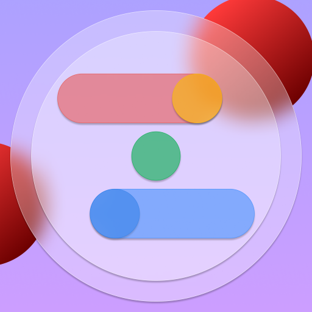

## ようこそ!!

こんにちは!!ZIPです!!  
会えて嬉しいです!!  

## Who am I?
 

ZIPです。電子工作とプログラミングが好きな中学生です。D-Techsとthinkingに所属。

## Stats

## Skills
### Python
Qt for PythonとかTkinterを使ってGUIアプリを作ったり、Janomeを使ってマルコフ連鎖で怪文書作ったり。  

### HTML/CSS
めちゃくちゃお粗末なサイトなら作れます。  

### マイコン/電子工作
ArduinoとかM5Stackとかmicro:bitとか。あと、MOSFETとか抵抗とかコンデンサを燃やしたりもします。  

### C言語
難しいからできるだけ使いたくない。  

### Qt
そこそこ。テキストエディタならできたり。  

### JavaScript/Node.js
あんまり。勉強中です。

### ???隠れた趣味???
実は、天体観測が趣味だったりします。

## Projects
### Active
#### Syogatsu Browser
正月ブラウザー(Syogatsu Browser)は、オープンソースのブラウザーです。  
Github repo: [here](https://github.com/1234Yosuke/syogatsu_browser)  

#### TextP / TextQ
TextPは、Pythonによって作られたテキストエディタです。  
姉妹プロジェクトとして、TextQがあります。  
Site: [here](https://textediterp.wordpress.com/)  
Github repo: [TextP](https://github.com/1234Yosuke/TextP) [TextQ](https://github.com/1234Yosuke/TextQ)  

### Completed
#### Ningen-Hassya
人間発射は、Scratchによって作られたゲームです。ZS Studiosによって開発されました。  
Scratch: [here](https://scratch.mit.edu/projects/338201323/)  

## Blogs

## Contacts
Twitter: [@ZIP_Muryobochi](https://twitter.com/ZIP_Muryobochi)  
GitHub: [@1234Yosuke](https://github.com/1234Yosuke)  
Discord: [ZIPのサーバー](https://discord.gg/fh4AJJdcZb)  

## Organizations
### ZS Studios
ZS Studiosは、ZIPがリーダーを務めるゲームなどを開発するなにかです。よかったら参加してくれると嬉しいです。  
ZS Studios Official Site: [https://zsstudios.github.io/ZS_Studios/](https://zsstudios.github.io/ZS_Studios/)  
ZS Studios Discord: [ZS Studios](https://discord.gg/4FhXSBceMx)  
ZS Studios Twitter: [ZSStudios1](https://twitter.com/ZSStudios1)  
ZS Studios GitHub: [zsstudios](https://github.com/zsstudios)  

### Diverse Techs Circle
Diverse Techs Circle (D-Techs Circle)は、「プログラミングや動画編集が好き。だけど一緒にできる仲間がいない。」そんな方のために作られたコミュニティです。デジタル技術の知見を共有し合い、共同開発を行います。  
D-Techs Official Site: [https://dtechs.net/](https://dtechs.net/)  
D-Techs Twitter: [@Dtechs_Circle](https://twiiter.com/Dtechs_Circle)  

### thinking
thinkingは、Sorakimeさんが作ったクリエイターグループです。詳しくはSorakimeさんまで。  
